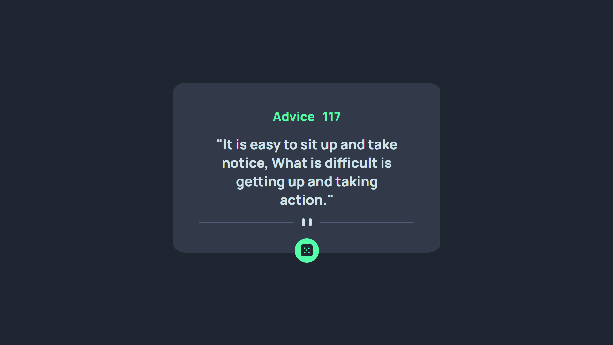

# Frontend Mentor - Advice generator app solution

This is a solution to the [Advice generator app challenge on Frontend Mentor](https://www.frontendmentor.io/challenges/advice-generator-app-QdUG-13db). Frontend Mentor challenges help you improve your coding skills by building realistic projects.

## Table of contents

- [Overview](#overview)
  - [The challenge](#the-challenge)
  - [Screenshot](#screenshot)
  - [Links](#links)
- [My process](#my-process)
  - [Built with](#built-with)
- [Author](#author)

### The challenge

Users should be able to:

- Generate Random Advices 
- View the app based on device width

### Screenshot

### Links

- Solution URL: [Github](https://github.com/M0hamedMagdy/frontendmentor/tree/main/advice-generator-app)
- Live Site URL: [ Github Pages](https://m0hamedmagdy.github.io/frontendmentor/advice-generator-app/)

### Built with

- Semantic HTML5 markup
- CSS custom properties
- Flexbox
- Mobile-first workflow
- Fetch & Ajax

## Author
- Frontend Mentor - [@M0hamedMagdy](https://www.frontendmentor.io/profile/M0hamedMagdy)
- Twitter - [@imohameds2](https://www.twitter.com/imohameds2)

