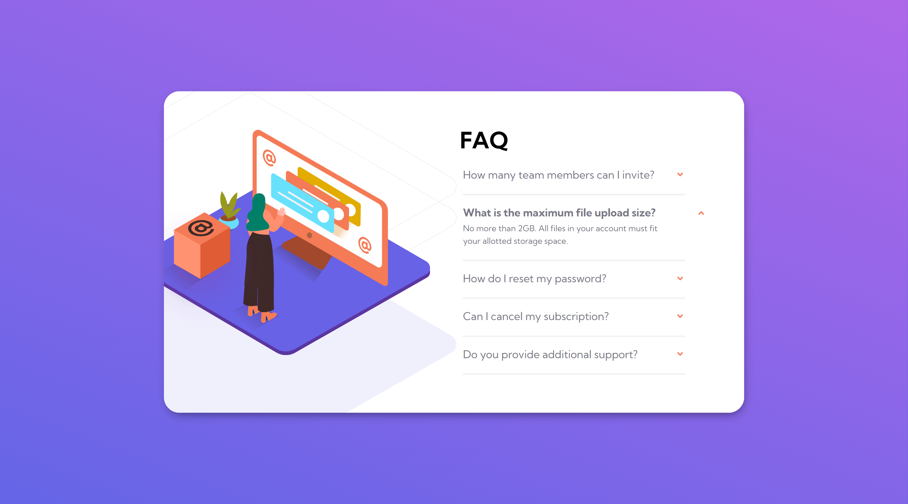

# Frontend Mentor - FAQ accordion card solution

This is a solution to the [FAQ accordion card challenge on Frontend Mentor](https://www.frontendmentor.io/challenges/faq-accordion-card-XlyjD0Oam). Frontend Mentor challenges help you improve your coding skills by building realistic projects. 

## Table of contents

- [Overview](#overview)
  - [The challenge](#the-challenge)
  - [Screenshot](#screenshot)
  - [Links](#links)
- [My process](#my-process)
  - [Built with](#built-with)
  - [What I learned](#what-i-learned)
- [Author](#author)


## Overview

### The challenge

Users should be able to:

- View the optimal layout for the component depending on their device's screen size
- See hover states for all interactive elements on the page
- Hide/Show the answer to a question when the question is clicked

### Screenshot



### Links

- Solution URL: [GitHub](https://github.com/M0hamedMagdy/frontendmentor/tree/main/faq-accordion-card)
- Live Site URL: [GitHub Pages](https://m0hamedmagdy.github.io/frontendmentor/faq-accordion-card)

## My process

### Built with

- Semantic HTML5 markup
- CSS custom properties
- Flexbox

### What I learned


```html
 <details>
    <summary>How many team members can I invite?</summary>
    <p>You can invite up to 2 additional users on the Free plan.</p>
 </details>
```
```css
details summary::-webkit-details-marker {
    display:none;
}
```

## Author

- Frontend Mentor - [@M0hamedMagdy](https://www.frontendmentor.io/profile/M0hamedMagdy)
- Twitter - [@imohameds2](https://www.twitter.com/imohameds2)

