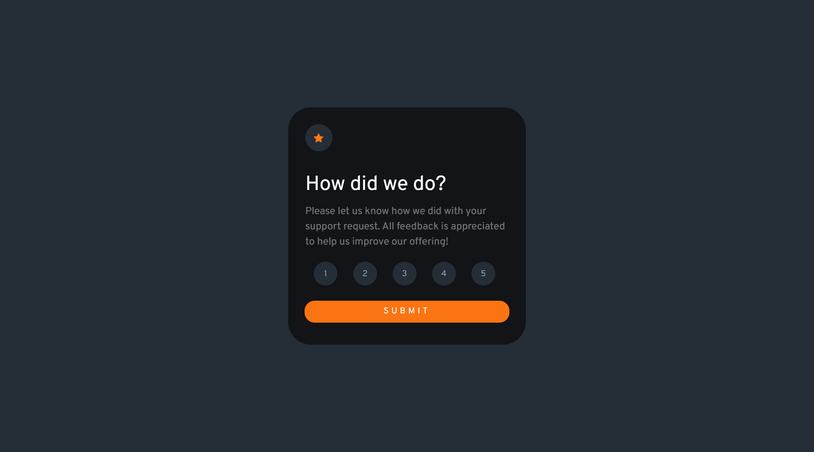

# Frontend Mentor - Interactive rating component solution

This is a solution to the [Interactive rating component challenge on Frontend Mentor](https://www.frontendmentor.io/challenges/interactive-rating-component-koxpeBUmI). Frontend Mentor challenges help you improve your coding skills by building realistic projects. 

## Table of contents

- [Overview](#overview)
  - [The challenge](#the-challenge)
  - [Screenshot](#screenshot)
  - [Links](#links)
- [My process](#my-process)
  - [Built with](#built-with)
  - [What I learned](#what-i-learned)
  - [Continued development](#continued-development)
- [Author](#author)

### The challenge

Users should be able to:

- View the optimal layout for the app depending on their device's screen size
- See hover states for all interactive elements on the page
- Select and submit a number rating
- See the "Thank you" card state after submitting a rating

### Screenshot

### Links

- Solution URL: [Github](https://github.com/M0hamedMagdy/frontendmentor/blob/main/interactive-rating-component)
- Live Site URL: [Github Pages](https://m0hamedmagdy.github.io/frontendmentor/interactive-rating-component)

## My process

### Built with

- Semantic HTML5 markup
- Flexbox
- [TailwindCSS](https://tailwindcss.com/) - CSS framework
- Tailwind Custom Properties
- [Alpinejs](https://alpinejs.dev/) - JS framework

### What I learned
- Alpinejs
- TaliwindCSS 
- TaliwindCSS Config

### Continued development
- The Ability to select only one rate component.

## Author

- Frontend Mentor - [@M0hamedMagdy](https://www.frontendmentor.io/profile/M0hamedMagdy)
- Twitter - [@imohameds2](https://www.twitter.com/imohameds2)

