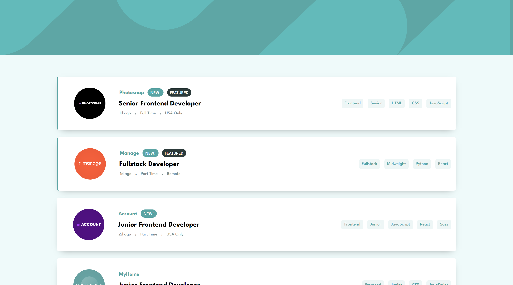

# Frontend Mentor - Job listings with filtering solution

This is a solution to the [Job listings with filtering challenge on Frontend Mentor](https://www.frontendmentor.io/challenges/job-listings-with-filtering-ivstIPCt). Frontend Mentor challenges help you improve your coding skills by building realistic projects.

## Table of contents

- [Overview](#overview)
  - [The challenge](#the-challenge)
  - [Screenshot](#screenshot)
  - [Links](#links)
- [My process](#my-process)
  - [Built with](#built-with)
- [Author](#author)

## Overview

### The challenge

Users should be able to:

- View the optimal layout for the site depending on their device's screen size
- See hover states for all interactive elements on the page
- Filter job listings based on the categories

### Screenshot

### Links

- Frontend (Reactjs) URL: [Github](https://github.com/M0hamedMagdy/FrontEnd-Mentor-Joblisting-React)
- FullStack (ExpressJS) URL: [Github](https://github.com/M0hamedMagdy/frontendmentor/tree/main/joblistings-filtering)
- Live Site URL: [Heroku](https://joblisting-filter.herokuapp.com/)

## My process

### Built with

- Semantic HTML5 markup
- CSS custom properties
- Flexbox
- CSS Grid
- [React](https://reactjs.org/) - JS library
- [Axios](https://axios-http.com/docs/intro) - HTTP Client
- [Styled Components](https://styled-components.com/) - For styles
- [Expressjs](https://expressjs.com/) - Node.js web application framework
- [Heroku](https://www.heroku.com) - Cloud Application Platformhttps

## Author

- Frontend Mentor - [@M0hamedMagdy](https://www.frontendmentor.io/profile/M0hamedMagdy)
- Twitter - [@imohameds2](https://www.twitter.com/imohameds2)
