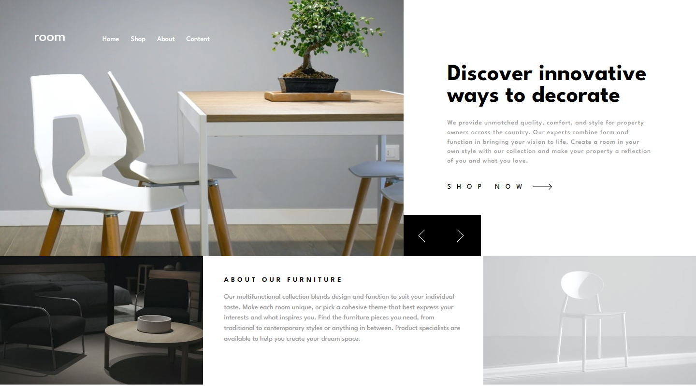

# Frontend Mentor - Room homepage solution

This is a solution to the [Room homepage challenge on Frontend Mentor](https://www.frontendmentor.io/challenges/room-homepage-BtdBY_ENq). Frontend Mentor challenges help you improve your coding skills by building realistic projects.

## Table of contents

- [Overview](#overview)
  - [The challenge](#the-challenge)
  - [Screenshot](#screenshot)
  - [Links](#links)
- [My process](#my-process)
  - [Built with](#built-with)
  - [Continued development](#continued-development)
- [Author](#author)

## Overview

### The challenge

Users should be able to:

- View the optimal layout for the site depending on their device's screen size
- See hover states for all interactive elements on the page
- Navigate the slider using either their mouse/trackpad or keyboard

### Screenshot

### Links

- Solution URL: [GitHub](https://github.com/M0hamedMagdy/frontendmentor/tree/main/room-homepage-master)
- Live Site URL: [GitHub](http://m0hamedmagdy.github.io/frontendmentor/room-homepage-master)

## My process

### Built with

- Semantic HTML5 markup
- CSS custom properties
- JavaScript
- DOM
- Flexbox

### Continued development

    NavBar for Mobile.
    Adjust The images

## Author

- Frontend Mentor - [@m0hamedmagdy](https://www.frontendmentor.io/profile/m0hamedmagdy)
- Twitter - [@imohameds2](https://www.twitter.com/imohameds2)
